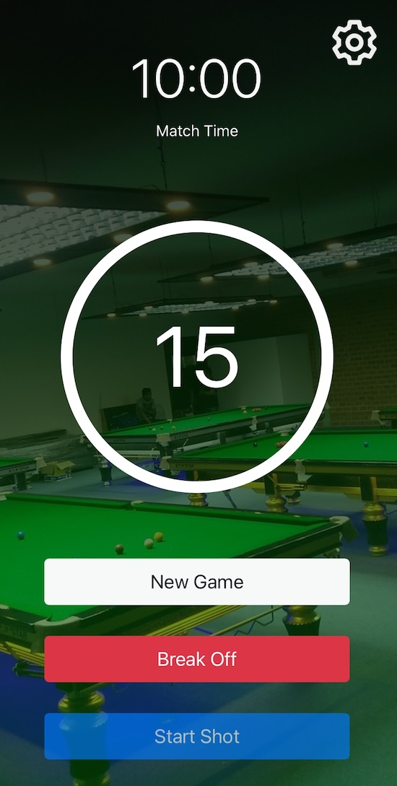

# Snooker Shootout   

[Snooker Shootout](https://snooker-shootout.web.app/) is a timer for shootout matches, available on Mobile, Web and Desktop.



## Project setup
```
npm install
```

### Compiles and hot-reloads for development
```
npm run serve
```

### Compiles and minifies for production
```
npm run build
```

### Run your unit tests
```
npm run test:unit
```

### Run your end-to-end tests
```
npm run test:e2e
```

### Lints and fixes files
```
npm run lint
```

### Customize configuration
See [Configuration Reference](https://cli.vuejs.org/config/).
